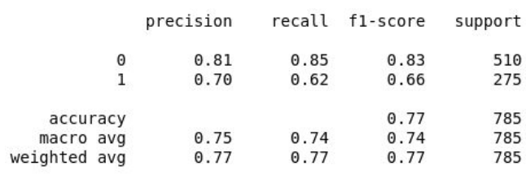
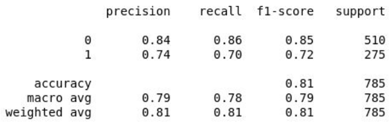

# DeftEval
<p align="center">
  
</p>
<p align="center">
  Made with :heart: by <b>Amr Elzawawy</b>, <b>Omar Swidan</b> and <b>Mostafa Yousry</b>.
</p>

This work was developed as final project for AI Course Fall 2019/2020 offering at AlexU Faculty of Engineering. It is our offical contribution for [Deft Eval Competition Subtask 1](https://competitions.codalab.org/competitions/22759) and running on it's offical [dataset](https://github.com/adobe-research/deft_corpus).
It was an amazing experience and a great oppurtinuity to learn and explore the NLP world ! We would like to thank you the organziers of the compeition for their great work and for their willingness to help hrough forum.

<p align = 'center'> 
 <a href="#intro">NLP Problem</a> <b> . </b>
  <a href="#comp">Competition & Dataset</a> <b> . </b>
  <a href="#work">Work & Contributions</a> <b> . </b>
  <a href="#refs">References</a>
</p>

## <a name="intro"></a> Understanding The Problem

**Definition Extraction** (DE) is the task to extract textual definitions from naturally occurring text. It is **gaining popularity** as a prior step for constructing taxonomies, ontologies, automatic glossaries or dictionary entries. These fields of application motivate greater interest in well-formed encyclopedic text from which to extract definitions, and therefore DE for academic or lay discourse has received less attention. 

Historically, **Definition extraction** has been a popular topic in NLP research for well more than a decade, but has been limited to well defined, structured, and narrow conditions. In reality, natural language is complicated, and complicated data requires both complex solutions and data that reflects that reality.

### Problem's Background
Definitions are a well-studied topic, which traces back to the Aristotelian genus et differentia model of a definition, where the defined term (definiendum) is described by mentioning its immediate superordinate, usually a hypernym (genus), and the cluster of words that differentiate such definiendum from others of its class (definiens). 

Furthermore, additional research has elaborated on different criteria to take into consideration when deciding what is a definition: either by looking at their degree of formality (Trimble, 1985), the extent to which they are specific to an instance of an object or to the object itself (Seppal¨ a, 2009), the semantic relations holding between definiendum and concepts included in the definiens (Alarcon et al., 2009; Schumann, 2011), ´ the fitness of a definition for target users (Bergenholtz and Tarp, 2003; Fuertes-Olivera, 2010) or their stylistic and domain features (Velardi et al., 2008)

### Problem's Applications
It has received notorious attention for its potential application to **glossary generation** (Muresan and Klavans, 2002; Park et al.,2002), **terminological databases** (Nakamura and Nagao, 1988), **question answering systems** (Saggion and Gaizauskas, 2004; Cui et al., 2005), for supporting terminological applications (Meyer, 2001; Sierra et al., 2006), **e-learning** (Westerhout and Monachesi, 2007), and more recently for **multilingual paraphrase extraction** (Yan et al., 2013), **ontology learning** (Velardi et al., 2013) or **hypernym discovery** (Flati et al., 2014).

###  Problem's Related Work
The earliest attempts focused on **lexico-syntactic pattern-matching, either by looking at cue verbs** (Rebeyrolle and Tanguy, 2000; Saggion and Gaizauskas, 2004; Sarmento et al., 2006; Storrer and Wellinghoff, 2006), **or other features like
punctuation or layout** (Muresan and Klavans, 2002; Malaise et al., 2004; S ´ anchez and M ´ arquez, 2005; ´
Przepiorkowski et al., 2007; Monachesi and Westerhout, 2008).

As for supervised settings, let us refer to (Navigli and Velardi, 2010), who **propose a generalization of word lattices for identifying definitional components and ultimately identifying definitional text fragments.** Finally, **more complex morphosyntactic patterns** were used by (Boella et al., 2014), who model single tokens as relations over the sentence syntactic dependencies.
Or unsupervised approaches (Reiplinger et al., 2012) **benefit from hand crafted definitional patterns.**

---

## <a name="comp"></a> Undertsanding the competition
DeftEval 2020 is part of SemEval 2020 official competition (Task 6). Organized by the Adobe Document Cloud Team. 
DeftEval is split into three subtasks,
- **Subtask 1: Sentence Classification**, Given a sentence, classify whether or not it contains a definition. This is the traditional definition extraction task.

- **Subtask 2: Sequence Labeling**, Label each token with BIO tags according to the corpus' tag specification.

- **Subtask 3: Relation Classification**, Given the tag sequence labels, label the relations between each tag according to the corpus' relation specification.

### Understanding the DEFT Corpus
The DEFT corpus contains roughly 7,000 sets of 3-sentence groupings extracted from textbooks of various topics from cnx.org. Each sentence set reflects a context window around which the author of the original text marked a bolded word to indicate a key term. For annotation reasons, the bolded words are not included in the annotated corpus, though you may find them from the textbooks themselves. Each grouping may have multiple term-definition pairs or none at all - it is simply a context window around a likely location for a term.

Train and dev data is provided to you in a CONLL-like tab-deliniated format. Each line represents a token and its features. A single blank line indicates a sentence break; two blank lines indicates a new 3-sentence context window. All context windows begin with a sentence id followed by a period. These are treated as tokens in the data. Each token is represented by the following features:
<p align="center">
  <b><i>[TOKEN] [SOURCE] [START_CHAR] [END_CHAR] [TAG] [TAG_ID] [ROOT_ID] [RELATION]</i></b>
</p>

Where: 

* **SOURCE** is the source .txt file of the excerpt
* **START_CHAR/END_CHAR** are char index boundaries of the token
* **TAG** is the label of the token (O if not a B-[TAG] or I-[TAG])
* **TAG_ID** is the ID associated with this TAG (0 if none)
* **ROOT_ID** is the ID associated with the root of this relation (-1 if no relation/O tag, 0 if root, and TAG_ID of root if not the root)
* **RELATION** is the relation tag of the token (0 if none).

### Understanding Dataset Folder Structure (released on Github)
- `deft_corpus\data\deft_files`: contains the dataset files itself. It has two splits divided into two subfolders: 
  - `train`: For training split. 
  - `dev`: For development split (used as testing data for evaluation when submitting on website in Training Phase).
- `deft_corpus\data\reference_files`: Are used in the Codalab pipeline for evaluation purposes. When you submit your predictions via Codalab, these are the exact files that the scoring program evaluates your submission against.
- `deft_corpus\data\source_txt`: The original sentences extracted from the textbooks used in the dataset. The source_txt has 80 files full of sentences for training and 68 files for development with less sentences per file.
The deft_files have nearly the same files names as in source_text. 
- `deft_corpus\task1_convertor.py`: This script is used to convert from the sequence/relation labeling format to classification format.This produces files in the following tab-delineated format: **[SENTENCE]  [HAS_DEF]**. 
This is intended for Subtask 1: Sentence Classification.


### Understanding Dataset Annotation Schema 
The DEFT annotation schema is comprised of terms and definitions, as well as various auxiliary tags which aid in identifying complex or long-distance relationships between a term-definition pair. With the exception of "implicit" definitions (defined below), all terms are linked in some way to a definition or alias term.

#### Tag Full Schema

* **Term:** A primary term.
* **Alias Term:** A secondary or less common name for the primary term. Links to a term tag.
* **Ordered Term:** Multiple terms that have matching sets of definitions which cannot be separated from each other without creating a non-contiguous sequence of tokens. (Eg. x and y represent positive and negative versions of definition z, respectively)
* **Referential Term:** An NP reference to a previously mentioned term tag. Typically this/that/these + NP following a sentence boundary.
* **Definition:**	A primary definition of a term. May not exist without a matching term.
* **Secondary Definition:** Supplemental information that may qualify as a definition sentence or phrase, but crosses a sentnece boundary.
* **Ordered Definition:**	Multiple definitions that have matching sets of terms which cannot be separated from each other. See Ordered Term.
* **Referential Definition:**	NP reference to a previously mentioned definition tag. See Referential Term.
* **Qualifier:** A specific date, location, or other condition under which the definition holds true. Typically seen at the clause level.

#### Relation Full Schema
* **Direct-defines**	Links definition to term.
* **Indirect-defines**	Links definition to referential term or term to referential definition.
* **Refers-to**	Links referential term to term or referential definition to definition.
* **AKA**	Links alias term to term.
* **Supplements**	Links secondary definition to definition, or qualifier to term.

### Evaluation of Tasks 
Test data will be evaluated in the following CONLL-2003-like formats:

- Subtask 1: Sentence Classification 
  - **[SENTENCE] [BIN_TAG]** Where the binary tag is 1 if the sentence contains a definition and 0 if the sentence does not contain a definition. We will report P/R/F1 for the positive and negative classes. The official score will be based on the F1 for the positive class.


- Subtask 2: Sequence Labeling
  - **[TOKEN] [SOURCE] [START_CHAR] [END_CHAR] [TAG]** We will report P/R/F1 for each evaluated class, as well as macro- and micro-averaged F1 for the evaluated classes. The official score will be based on the macro-averaged F1 of the evaluated classes. Evaluated classes include: Term, Alias-Term, Referential-Term, Definition, Referential-Definition, and Qualifier.


- Subtask 3: Relation Extraction
  - **[TOKEN] [SOURCE] [START_CHAR] [END_CHAR] [TAG] [TAG_ID] [ROOT_ID] [RELATION]** Where ROOT_ID is -1 if there is no relation, 0 if the token is part of the root, and TAG_ID of the root if the token points to the root. We will report P/R/F1 for each evaluated relation, as well as macro- and micro-averaged F1 for the evaluated relations. The official score will be based on  the macro-averaged F1 of the evaluated relations. The evaluated relations include: Direct-defines, Indirect-defines, Refers-to, AKA, and Qualifies.
  
For specifics about evaluation and submission through the CodeLab you can check [this](https://competitions.codalab.org/competitions/20900#learn_the_details-evaluation).

---

## <a name="work"></a> Our Work & Contributions
We present in this repository our efforts to solve the famous definition extraction NLP problem as our official partcipation in DeftEval 2020 compeition on codalab. We built multiple approaches ranging from basline approaches to much complex ones. Our Approaches are listed below, then we explore them one by one in much detail.
- Basline approach using BOW or TF-IDF with classical ML classifiers (NB - LR)
- Using Doc2vec with external training corpus.
- Using Doc2vec with training on our data.
- Using word2vec summation.
- Using Spacy's Text Classfier Pipeline.
- Using LSTM
- Using SBERT

### **1. Baseline approach using BOW or TF-IDF with classical ML classifiers (NB - LR)**
We seek to combine classical embedding techniques and classical machine learning classifiers in order to build a solution.
BoW converts text into the matrix of occurrence of words within a given document. It focuses on whether given words occurred or not in the document.

TF-IDF (Term Frequency-Inverse Document Frequency) is simply a way of normalizing our Bag of Words(BoW) by looking at each word’s frequency in comparison to the document frequency. In other words, it’s a way of representing how important a particular term is in the context of a given document, based on how many times the term appears and how many other
documents that same term appears in.

N-grams are combinations of adjacent words in a given text, where n is the number of words that are included in the tokens. In all the embedding techniques used here we have ​ N-grams range set with the lower and upper bounds suitable for every experiment.  

Classifiers Used in this approach:
+ **LR (Logistic Regression):** is a statistical model that in its basic form uses a logistic function to model a binary dependent variable.
+ **NB (Naive Bayes):** are a set of supervised learning algorithms based on applying Bayes’ theorem with the “naive” assumption of conditional independence between every pair of features given the value of the class variable. We use the Multinomial variation here.
+  **DTs (Decision Trees):** are a non-parametric supervised learning methods used for classification and regression. The goal is to create a model that predicts the value of a target variable by learning simple decision rules inferred from the data features.   

**Results of Approach 1:**  
Below are the classification report of the best score recorded in this
approach with F1 score for positive class = 0.66. This was the result of
using Logistic Regression with Bag of Words.
<p align ="center">

</p>

### **2. Using Doc2vec with external training corpus**
**Doc2Vec** is a model that represents each Document as a Vector. The goal of Doc2Vec is to create a numeric representation of a document, regardless of its length. So, the input of texts per document can be various while the output is fixed-length vectors.   
Design of Doc2Vec is based on Word2Vec. But unlike words, documents do not come in logical structures such as words, so the another method has to be found. There are two implementations:

1. Paragraph Vector - Distributed Memory (PV-DM)
2. Paragraph Vector - Distributed Bag of Words (PV-DBOW)

**Gensim's** Doc2Vec class implements Doc2Vec algorithm. To define Gensim Doc2Vec model there are some attributes could be set like:
* **Vector Size:** Dimensionality of the documents feature vector.
* **Min Count:** Ignores all words with total frequency lower than this.
* **Epochs:** Number of iterations (epochs) over the corpus.
* **Workers:** Use these many worker threads to train the model (faster training with multicore machines).   
```python
model = Doc2Vec(vector_size=50, min_count=2, epochs=40, workers=8)
```
After defining the shape of the mode, we will create the vocabulary of words then the model will be trained on the training corpus
```python
model.build_vocab(train_corpus)
model.train(train_corpus, total_examples=model.corpus_count,epochs=model.epochs)
``` 
Now the Doc2Vec model is ready to vectorize the sentence and give it its numerical features vector. 

**Apply Classification Algorithms:**  
All the following classification methods are used from **sklearn** library and a classification report is provided given the predicted labels -after performing the algorithm on the test data- and the true labels.

| Algorithm           | F1-score class 0| F1-score class 1| Accuracy |
| ------------------- |:---------------:|:---------------:|:--------:|
| Naive Bayes         | 0.75            | 0.38            | 0.65     |
| Decision Tree       | 0.70            | 0.40            | 0.60     |
| Logistic Regression | 0.72            | 0.52            | 0.64     |

### **3. Using Doc2Vec and Training on our data**

**Apply Classification Algorithms:**  
All the following classification methods are used from **sklearn** library and a classification report is provided given the predicted labels -after performing the algorithm on the test data- and the true labels.

| Algorithm           | F1-score class 0| F1-score class 1| Accuracy |
| ------------------- |:---------------:|:---------------:|:--------:|
| Naive Bayes         | 0.78            | 0.61            | 0.72     |
| Linear SVC          | 0.77            | 0.60            | 0.71     |
| Logistic Regression | 0.77            | 0.60            | 0.71     |


### **4. Using word2vec summation**
**Word2Vec** is a more recent model that embeds words in a lower-dimensional vector space using a shallow neural network. The result is a set of word-vectors where vectors close together in vector space have similar meanings based on context, and word-vectors distant to each other have differing meanings. For example, strong and powerful would be close together and strong and Paris would be relatively far.

<p align="center">

</p>

With the Word2Vec model, we can calculate the vectors for each word in a document. But what if we want to calculate a vector for the entire document?. We could use Word2Vec for this task by inferring a vector for each word in the document using Word2Vec model then summing all these words vectors to create one vector that represent the whole document.   

**Gensim** has its Word2Vec model but here we added to it **GoogleNews Word Embeddings** which is a file contains vectors for 3 millions word get from google news. Each on of these vectors is 300 demission.
```python
model = KeyedVectors.load_word2vec_format('GoogleNews-vectors-negative300.bin', binary=True)
```

**Apply Classification Algorithms:**  
All the following classification methods are used from **sklearn** library and a classification report is provided given the predicted labels -after performing the algorithm on the test data- and the true labels.

| Algorithm           | F1-score class 0| F1-score class 1| Accuracy |
| ------------------- |:---------------:|:---------------:|:--------:|
| Naive Bayes         | 0.74            | 0.41            | 0.64     |
| Decision Tree       | 0.74            | 0.52            | 0.66     |
| Logistic Regression | 0.76            | 0.58            | 0.69     |

### **5. Using Spacy's Text Classfier Pipeline**
Textclassification models in **Spacy** can be used to solve a wide variety of problems. Differences in text length, number of labels, difficulty, andruntime performance constraints mean that no single algorithm
performs well on all types of problems. To handle a wider variety of problems, the **TextCategorizer** object
allows configuration of its **model architecture**, using the architecture keyword argument.

Chosen Architecture to be used is **simple_cnn** , a **neural network** model where token vectors are calculated using a CNN. Built the model over an **existing language model** from Spacy *en_core_web_lg* instead of building it over a blank language model. We had to change the label format to match the Spacy Labeling Format. Instead of a binary vector for labels we will have for each label value a dict indicating whether this instance is a definition or not.
Example: *{"DEFINITION": True, "NOT DEFINITION": False}*  

**Training Details:**
+ Used **compounding batch sizes** of starting size 32, maximum size of
100 and step size 1.001. This values were manually tuned to find the
best results at them.
+ For each iteration, we evaluate the model by computing loss, precision,
recall, f1-score on evaluation data (dev split). **Main metric was loss**.
+ Used **dropout** rate of 0.2 and **Adam** Optimizer
+ Used **early stopping** with loss <= 0.005

**Classification Report:**
<p align="center">  

</p>

### **6. Using LSTM**
**LSTM** Long short-term memory (LSTM) is an artificial recurrent neural network (RNN) architecture. A common LSTM unit is composed of a cell, an input gate, an output gate and a forget gate. The cell remembers values over arbitrary time intervals and the three gates regulate the flow of information into and out of the cell.

**Network Summary**
  
| Layer (type)    |     Output Shape    | Param #  |
| ----------------|:-------------------:|:--------:|
| Embedding       |  (None, None, 100)  |  1579300 |
| Bidirectional   |  (None, 200)        |  160800  |
| Dense           |  (None, 15793)      |  3174393 |
| Dense           |  (None, 1)          |  15794   |

**Using Word2Vec as The Fixed Embeddings in the Embeddings Layer:**  
  
| F1-score class 0| F1-score class 1| Accuracy |
| ----------------|:---------------:|:--------:|
| 0.78            | 0.61            | 0.72     |

**Using Glove Embeddings:**
  
The second approach used with LSTM is using Glove's embeddings as the fixed embeddings of the embeddings layer. GloVe is an unsupervised learning algorithm for obtaining vector representations for words. Training is performed on aggregated global word-word co-occurrence statistics from a corpus, and the resulting representations showcase interesting linear substructures of the word vector space. The network is used with freezing the embeddings and with training them to experiment on the different results. The shown results is of the trainable weights.

| F1-score class 0| F1-score class 1| Accuracy |
| ----------------|:---------------:|:--------:|
| 0.78            | 0.35            | 0.67     |

### **7. Using SBERT**
**BERT (Bidirectional Encoder Representations from Transformers)** is a paper published by researchers at Google AI Language. It has caused a stir in the Machine Learning community by presenting state-of-the-art results in a wide variety of NLP tasks. BERT produces out-of-the-box rather bad sentence embeddings. Sentence BERT paper fine-tunes BERT / RoBERTa / DistilBERT / ALBERT / XLNet with a siamese or triplet network structure to produce semantically meaningful sentence embeddings that can be used in unsupervised scenarios. The embeddings are used to encode the documents and use a naive bayes classifier to classify the dev dataset. The results shown are of the classification using the naive bayes classifier.

| F1-score class 0| F1-score class 1| Accuracy |
| ----------------|:---------------:|:--------:|
| 0.67            | 0.53            | 0.61     |


## Conclusion
As a team of three members, each of us had the chance to work on the problem and its solution framework from start to end in order to have a cumbersome of approaches to a solution at the end of the day. It was a truely frutiful learning experience and yet a quick dive into the large vast domain of NLP. **The best scores resulted was from the Spacy's Text Classifier approach.** Other approaches didn't do good enough at all but it was noteable to try them in order to rule them out. We plan now for the online submission to sumbit the Spacy's text classifier results and see how will we rank in the leaderboards hopefully. Now we recommend you take a look at the references below for more exploration. :closed_book: :green_book:

## <a name="refs"></a> References
1. [*Weakly Supervised Definition Extraction (Luis Espinosa-Anke, Francesco Ronzano and Horacio Saggion), Proceedings of Recent Advances in Natural Language Processing, pages 176–185,Hissar, Bulgaria, Sep 7–9 2015.*](https://www.aclweb.org/anthology/R15-1025.pdf)

2. [*DEFT: A corpus for definition extraction in free- and semi-structured text, Sasha Spala, Nicholas A. Miller, Yiming Yang, Franck Dernoncourt, Carl Dockhorn*](https://www.aclweb.org/anthology/W19-4015/). [Check the Github Repo.](https://github.com/adobe-research/deft_corpus)
  
3. [*CodaLab DeftEval 2020 (SemEval 2020 - Task 6), Organized by sspala.*](https://competitions.codalab.org/competitions/20900#learn_the_details)

4. [*Training a text classification model, spacy docs*](https://spacy.io/usage/training#textcat)

5. [*Document Embedding Techniques: A review of notable literature on the topic by Shay Palachy*](https://towardsdatascience.com/document-embedding-techniques-fed3e7a6a25d)
